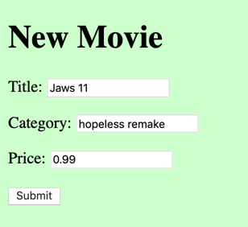

# evote-movie-2020-10-create-movie

Let's a add link and form to add new Movies to the database:



- add a link at the bottom of the list movies page `/templates/list.html.twig`:
    
    ```twig
    
    <tr>
        <td>{{ movie.id }}</td>
        <td>{{ movie.title }}</td>
        <td>{{ movie.category }}</td>
        <td>&euro; {{ movie.price | number_format(2, '.', ',') }}</td>
        <td>{{ movie.voteAverage }} %</td>
        <td>{{ movie.numVotes }}</td>
        <td>
            
                
            
                (no votes yet)
            
        </td>
        <td>
            <a href="/index.php?action=deleteMovie&id={{ movie.id }}">
                DELETE
            </a>
        </td>
    </tr>
    

    </table>
    
    <a href="/index.php?action=newMovieForm">CREATE a new movie</a>
    ```
  
- add a new case in the front controller `run()` method in `WebApplication` to display the new movie form:

    ```php
    class WebApplication
    {
        public function run()
        {
            $action = filter_input(INPUT_GET, 'action');
            $mainController = new MainController();
            $movieController = new MovieController();
    
            switch ($action) {
                case 'newMovieForm':
                    $movieController->createForm();
                    break;
    ```

- add a new method `createForm()` in `MovieController` to display a form to create a new Movie:

- create the new template `/templates/newMovieForm.html.twig`:

    ```twig
    
    
    new movie
    
    
        <h1>
            New Movie
        </h1>
    
        <form action="/" method="post">
            <input type="hidden" name="action" value="processNewMovie">
    
            <p>
                Title:
                <input name="title">
            <p>
                Category:
                <input name="category">
            <p>
                Price:
                <input name="price">
            <p>
                <input type="submit">
        </form>
    
    
    ```
  
  
- add a new case in the front controller `run()` method in `WebApplication` to **process** the data submitted for the new movie form:

    ```php
        class WebApplication
        {
            public function run()
            {
                $action = filter_input(INPUT_GET, 'action');
                if(empty($action)){
                    $action = filter_input(INPUT_POST, 'action');
                }
                $mainController = new MainController();
                $movieController = new MovieController();
                
                switch ($action) {
                    case 'processNewMovie':
                        $movieController->processNewMovie();
                        break;

    ```
  
  - NOTE: Since the form data is being submitted with the HTTP `POST` method, including the `action` value, then we need to add some logic at the beginning of our `run()` method, so that if we find no value for `action` in the `GET` variables, then we look in the `POST` variables for a value:
  
        ```php
        $action = filter_input(INPUT_GET, 'action');
        if(empty($action)){
            $action = filter_input(INPUT_POST, 'action');
        }
        
        ```

  
- add a method in `MovieController` to retrieve the submitted new Movie form data, create a new Movie object, add it to the database, and then show the user the (updated) list of movies:

    ```php
    public function processNewMovie()
    {
        $title = filter_input(INPUT_POST, 'title');
        $category = filter_input(INPUT_POST, 'category');
        $price = filter_input(INPUT_POST, 'price');
        
        $m = new Movie();
        $m->setTitle($title);
        $m->setCategory($category);
        $m->setPrice($price);
        $m->setNumVotes(0);
        $m->setVoteTotal(0);
        
        $this->movieRepository->create($m);
        
        $this->listMovies();
    }
    ```